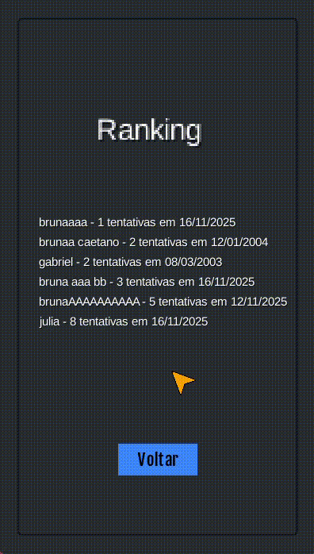

# MasterMind

Bruna Caetano - Sistemas de Informação

---

## Proposta
**Jogo mastermind**

No primeiro semestre, tive que fazer o jogo mastermind na disciplina de laboratório de programação 1. O jogo foi implementado em C em um primeiro momento e em Allegro em uma segunda entrega. O jogo consiste em tentar descobrir a sequência de cores em até 9 tentativas, a cada chute o sistema verifica se as cores chutadas estão na sequência e na posição certa.
Acho que minha motivação maior com essa proposta seria ver a diferença da implementação da lógica usando a orientação a objetos. Em C, as Structs tentam fazer um papel parecido a um objeto e ver como seria feito em Java é algo que fico bem curiosa para ver. Além disso, quando entreguei a versão final do trabalho, ele ainda possuia bastante erros de alocação de memória que não sabia corrigir naquele momento e gostaria de ver se hoje teria erros parecidos (mesmo que em outra linguagem). 

[Orientações da primeira versão do trabalho](https://github.com/BenhurUFSM/l122b/blob/main/Complementos/t5.md)

[Orientações da segunda versão do trabalho](https://github.com/BenhurUFSM/l122b/blob/main/Complementos/t6.md)

[Meu repositório do trabalho em C](https://github.com/brucvei/lab-programacao-1/tree/main/trabalho-06)

---

## Processo de desenvolvimento
O desenvolvimento do jogo foi feito utilizando a biblioteca libGDX, que é uma biblioteca para desenvolvimento de jogos em Java. A escolha dessa biblioteca se deu pelo fato de já ter tido contato com ela em outras ocasiões e por ser uma biblioteca bastante utilizada na comunidade de desenvolvimento de jogos em Java.

### Etapas do desenvolvimento:
1. Criação do projeto: Utilizei o setup do libGDX para criar o projeto base, escolhendo as opções de desktop e HTML.
2. Criação da tela inicial: Criei a tela inicial do jogo, onde o jogador pode iniciar o jogo, acessar o ranking ou as regras.
3. Criação da tela do jogo: Criei a tela onde o jogo acontece.
4. Implementação da lógica do jogo: Implementei a lógica do jogo a em uma classe separada.
5. Criação do ranking: Implementei a funcionalidade de ranking, onde os jogadores podem ver suas pontuações.
6. Implementação da lógica do ranking: Implementei a lógica do ranking no jogo para armazenar e ordenar as pontuações dos jogadores.
7. Criação da tela de regras: Criei uma tela onde o jogador pode ler as regras do jogo.

### Dificuldas e comentários:
- A curva de aprendizado do libGDX foi um pouco íngreme, mas consegui superar isso com a ajuda da documentação e tutoriais online.
- Tive alguma dificuldade em colocar os botões na tela pq foi bem complicado de entender que deveria ser atribuido ao stage e não ao batch diretamente.
- O deploy no itch.io foi um pouco complicado, principalmente por conta de ajustar as posições dos elementos na tela para que ficassem corretos no HTML.
- Acabei não utilizando tanto o trabalho inicial em C como base, porque a implementação da lógica em C se torna muito diferente em Java, principalmente por conta da orientação a objetos.
- As bolas que são draggable foram bem complicadas de implementar, tanto que não consegui resolver o problema de elas ficarem desalinhas do cursor enquanto são arrastadas.

### Conceitos de orientação a objetos:
Herança: BallDragable e BallNonDragable herdam Ball.
Composição: AttemptLine contém múltiplos objetos de Ball e Position.
Polimorfismo: As telas e a lógica podem manipular objetos do tipo Ball sem saber se são arrastáveis ou não.
[Diagrama de Classes](imgs/diagrama.png)

---

## Orientações para execução
Requisitos:
- Java JDK 11+ (recomendado JDK 17). Definir JAVA_HOME e adicionar Java ao PATH.
- Usar o Gradle wrapper incluído: gradlew.bat (nenhuma instalação global necessária).
- No terminal, navegar até o diretório do projeto.
- Executar o comando: `./gradlew lwjgl3:run`

---

## Resultado final

---

## Referências
- [Documentação oficial do libGDX](https://libgdx.com/dev/)
- [Creating a Simple Game in libGDX](https://libgdx.com/wiki/start/a-simple-game)
- [Extending the Simple Game](https://libgdx.com/wiki/start/simple-game-extended)
- [Cursor Visibility](https://libgdx.com/wiki/input/cursor-visibility-and-catching)
- [Buttons](https://libgdxinfo.wordpress.com/buttons-scene2d/)
- [Skins](https://github.com/czyzby/gdx-skins/tree/master/lgdxs)
- [Drag and Drop Elements](https://www.youtube.com/watch?v=9g8bkfQN9oU)
- [Input Text](https://libgdx.com/wiki/input/simple-text-input)
- [Manipulação de arquivos csv](https://blog.formacao.dev/manipulacao-de-arquivos-csv-em-java-leitura-e-escrita/)
- [Geração dos sprites das cores](imgs/gerar%20pecas.png)
- [Geraração do icone do jogo](imgs/icone.png)
- [Ajuda com os botões](imgs/socorro-gpt.png)
- [Ajuda com o drag and drop](imgs/socorro%20com%20draggable.png)
